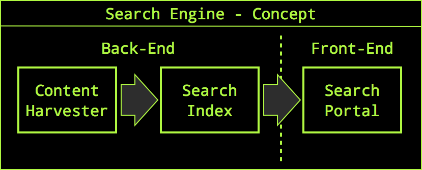
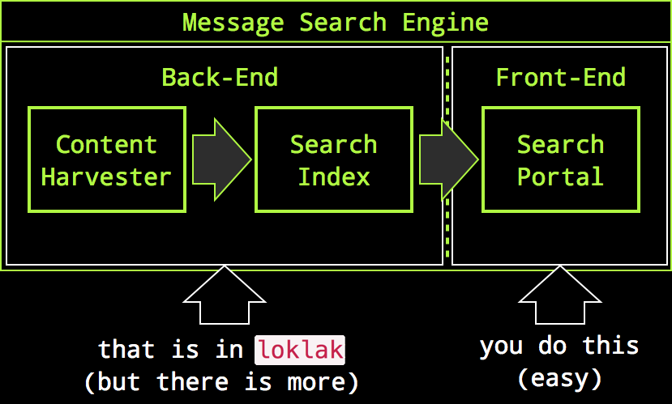
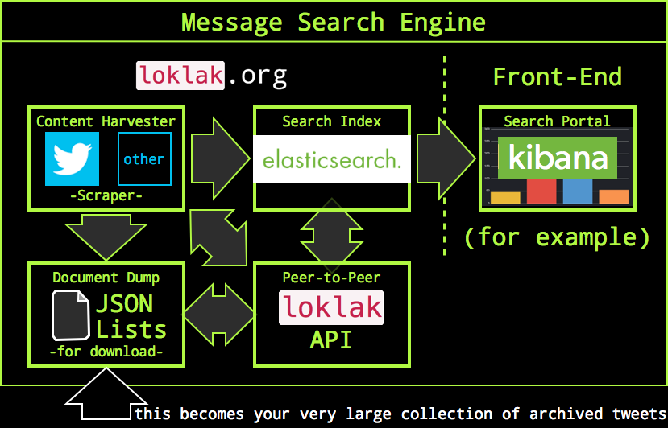

loklak
======

|Join the chat at https://gitter.im/loklak/loklak|
|Docker Pulls|
|Percentage of issues still open|
|Average time to resolve an issue|
|Twitter|
|Twitter Follow|

|Build Status|
|Build Status|

loklak is a server application which is able to collect messages from
various sources, including twitter. The server contains a search index
and a peer-to-peer index sharing interface. All messages are stored in
an elasticsearch index. An automatic deployment from the development
branch at GitHub is available for tests here
https://loklak-server-dev.herokuapp.com

'Lok Lak' is also a very tasty Cambodian stir-fry meat dish (usually
beef) with a LOT of fresh black pepper. If you ever have the chance to
eat Beef Lok Lak, please try it. I hope not to scare vegetarians with
this name, currently I am one as well.

Communication
-------------

Please join our mailing list to discuss questions regarding the project:
https://groups.google.com/forum/#!forum/loklak

Our chat channel is on gitter here: https://gitter.im/loklak/loklak

Why should I use loklak?
------------------------

If you like to be anonymous when searching things, want to archive
tweets or messages about specific topics and if you are looking for a
tool to create statistics about tweet topics, then you may consider
loklak. With loklak you can:

-  collect and store a very, very large amount of tweets
-  create your own search engine for tweets
-  omit authentication enforcement for API requests on twitter
-  share tweets and tweet archives with other loklak users
-  search anonymously on your own search portal
-  create your own tweet search portal or statistical evaluations
-  use `Kibana <https://github.com/elastic/kibana>`__ to analyze large
   amounts of tweets for statistical data.

We Capture Messages With Distributed Scrapers
---------------------------------------------

If you want to create an alternative Twitter search portal, the only way would
be to use the official Twitter API to retrieve Tweets. But that interface needs
an OAuth account and it makes your search portal completely dependent on
Twitter's goodwill. The alternative is, to scrape the Tweets from the Twitter
HTML search result pages, but Twitter may still lock you out on your IP address.
To circumvent this, you need many clients accessing Twitter to scrape search
results. This makes it necessary to create a distributed peer-to-peer network of
Twitter scrapers which can all organize, store and index Tweets. This solution
was created with Loklak.

Best of all: we made this very generic to integrate different microblogging
services, so this may be the incubator for an independent short message or
Twitter-like platform.

Not a Search Portal
-------------------

Search portals consist of many components, the most prominent parts are content
harvesters to acquire searchable content, a search index which provides fast and
efficient access to the data and a search front-end containing the user webpages
and result display servlets:

Most search portals differ in the way how they display search results but have
the almost same back-end to create the search index. We want to support the
creation of message/Twitter search portals but the necessary and most generic
part needs to be coded only once, even if we want several or even many different
search front-ends:

So it's on you to create a message search portal, but the very hard part for
this was already done by us. However, the front-end may also instantly be
there (i.e. you can just use :doc:`Kibana <installation/download>`).

Collect Messages
----------------

Collected messages are processed to two storage targets: an elasticsearch search
index and a backup- and transfer dump.

Short-Links are De-Shortened
----------------------------

To use as most possible characters in every Tweet message up to 140 characters,
links are shortened in all Tweets. First users used independent shortener
services but now Twitter shortens even already pre-shortened links again. We
remove the shortening of almost all links in the Tweet and reveal the original
URL the user has attached to their Tweets. This is very important when archiving
Tweets because shorteners may not be available in the future and also gives you
another privacy advancement because the shortener services cannot track you for
their purposes.

.. note::
   
  loklak can even de-shorten recursively, multi-shortened links.

Anonymous Harvesting and Search
-------------------------------

Anonymity is provided with different methods:

 * The loklak server does not record client IP-adresses when a search is done,
   therefore loklak.org, running loklak does also not record or log IP addresses
   from searchers.
 * You can run loklak yourself which gives you complete control over logged
   things (where no IP addresses are, but whatever).
 * Using a scraper, it is possible to break out of Twitter's 'OAuth-Prison', as
   you don't need an account to harvest Tweets.
   
   .. image:: docs/_assets/component_contentharvester.png
 * If you don't want to search on loklak.org and also don't want to scrape data
   from Twitter, you can still search in your own index and feed this index with
   import files from other loklak peers. (Look out for the 'Dumps' menu item in
   the top right corner.)
   
   .. image:: docs/_assets/component_searchindex.png
 * The built-in short-link de-shortener protects you from tracking by short-link
   services, including Twitter and bit.ly.

Distributed, Peer-to-Peer
-------------------------

loklak instances can be connected to each other. If you download loklak and run
it unchanged, it connects to loklak.org by default as a back-end peer. You can
change this if you want to. This is how connected peers work:

* Whenever a peer aquires new Tweets, it reports these to the back-end for
  storage. This means that fresh Tweets are stored at four locations: your own
  Elasticsearch index, your own message dump file and in the remote
  back-end-peer in the Elasticsearch index and dump file. This causes
  that all messages that you find are available for download for other
  users at the back-end which is by default loklak.org.
  
  .. image:: docs/_assets/component_jsonlistp2p.png
* Whenever a peer starts up, it calls the back-end to announce it's existence.
  This fills a peer-table in the back-end which everyone can use to retrieve the
  list of active peers. Therefore everyone can identify peers which may provide
  message-lists for download.
* Any topology can be achieved when the user changes the host name of the
  back-end. You can create your own message-sharing network easily.

How do I install loklak: Download, Build, Run

.. note:: You must be logged in to Docker Cloud for the button to work correctly. If you are not logged in, you’ll see a 404 error  instead.

---------------------------------------------

|Deploy|
|Deploy on Scalingo|
|Deploy to Bluemix|
|Deploy to Docker Cloud|

At this time, loklak is not provided in compiled form, you easily build
it yourself. It's not difficult and done in one minute! The source code
is hosted at https://github.com/loklak/loklak_server, you can download
it and run loklak with:

::

    > git clone https://github.com/loklak/loklak_server.git
    > cd loklak_server
    > ant
    > bin/start.sh

After all server processes are running, loklak tries to open a browser
page itself. If that does not happen, just open http://localhost:9000;
if you made the installation on a headless or remote server, then
replace 'localhost' with your server name.

To stop loklak, run: (this will block until the server has actually
terminated)

::

    > bin/stop.sh

A self-upgrading process is available which must be triggered by a shell
command. Just run:

::

    > bin/upgrade.sh

Where can I download ready-built releases of loklak?
~~~~~~~~~~~~~~~~~~~~~~~~~~~~~~~~~~~~~~~~~~~~~~~~~~~~

Nowhere, you must clone the git repository of loklak and build it
yourself. That's easy, just do

-  ``git clone https://github.com/loklak/loklak_server.git``
-  ``cd loklak``
-  then see above ("How do I run loklak")

How do I install loklak with Docker?
~~~~~~~~~~~~~~~~~~~~~~~~~~~~~~~~~~~~

To install loklak with Docker please refer to the `loklak Docker
installation readme <https://dev.loklak.org/server/installation/installation_docker.html>`__.

How do I deploy loklak with Heroku?
~~~~~~~~~~~~~~~~~~~~~~~~~~~~~~~~~~~

You can easily deploy to Heroku by clicking the Deploy to Heroku button
above. To install loklak using Heroku Toolbelt, please refer to the
`loklak Heroku installation readme <https://dev.loklak.org/server/installation/installation_heroku.html>`__.

How do I deploy loklak with cloud9?
~~~~~~~~~~~~~~~~~~~~~~~~~~~~~~~~~~~

To install loklak with cloud9 please refer to the `loklak cloud9
installation readme <https://dev.loklak.org/server/installation/installation_cloud9.html>`__.

How do I setup loklak on Eclipse?
~~~~~~~~~~~~~~~~~~~~~~~~~~~~~~~~~

To install loklak on Eclipse, please refer to the `loklak Eclipse
readme <https://dev.loklak.org/server/development/eclipseSetup.html>`__.

How do I run loklak?
~~~~~~~~~~~~~~~~~~~~

-  build loklak (you need to do this only once, see above)
-  run ``bin/start.sh``
-  open ``http://localhost:9000`` in your browser
-  to shut down loklak, run ``bin/stop.sh``

How do I analyze data acquired by loklak
----------------------------------------

| loklak stores data into an elasticsearch index. There is a front-end
| for the index available in elasticsearch-head. To install this, do:

-  ``sudo npm install -g grunt-cli``
-  ``cd`` into the parent directly of loklak\_server
-  ``git clone git://github.com/mobz/elasticsearch-head.git``
-  ``cd elasticsearch-head``
-  ``npm install``

Run elasticsearch-head with:

-  ``grunt server``
   ..which opens the administration page at ``http://localhost:9100``

How do I configure loklak?
--------------------------

The basis configuration file is in ``conf/config.properties``. To
customize these settings place a file ``customized_config.properties``
to the path ``data/settings/``

Where can I find documentation?
-------------------------------

The is available at http://dev.loklak.org.

Where can I find showcases and tutorials?
~~~~~~~~~~~~~~~~~~~~~~~~~~~~~~~~~~~~~~~~~

Articles and tutorials are also on our blog at http://blog.loklak.net.

Where do I find the java documentation?
~~~~~~~~~~~~~~~~~~~~~~~~~~~~~~~~~~~~~~~

At http://dev.loklak.org/javadoc or by building them via 'ant javadoc'.

Where can I get the latest news about loklak?
~~~~~~~~~~~~~~~~~~~~~~~~~~~~~~~~~~~~~~~~~~~~~

Hey, this is the tool for that! Just put
http://api.loklak.org/api/search.rss?q=%23loklak into your rss reader.
Oh wait.. you will get a lot of information about tasty Cambodian food
with that as well. Alternatively you may also read the authors timeline
using http://api.loklak.org/api/search.rss?q=0rb1t3r or just follow
@0rb1t3r (that's a zero after the at sign)

How to compile loklak using Gradle?
-----------------------------------

-  To install Gradle on Ubuntu:

::

   $ sudo add-apt-repository ppa:cwchien/gradle
   $ sudo apt-get update
   $ sudo apt-get install gradle

-  To install Gradle on Mac OS X with homebrew

``brew install gradle``

Compile the source to classes and a jar file

``gradle build``

Compiled file can be found in build dir

To remove compiled classes and jar file

``gradle clean``

What is the software license?
-----------------------------

LGPL 2.1

Where can I report bugs and make feature requests?
--------------------------------------------------

This project is considered a community work. The development crew
consist of YOU too. I am very thankful for pull request. So if you
discovered that something can be enhanced, please do it yourself and
make a pull request. If you find a bug, please try to fix it. If you
report a bug to me I will possibly consider it but at the very end of a
giant, always growing heap of work. The best chance for you to get
things done is to try it yourself. Our `issue tracker is
here <https://github.com/loklak/loklak_server/issues>`__.

| Have fun!
| @0rb1t3r

.. |Join the chat at https://gitter.im/loklak/loklak| image:: https://badges.gitter.im/Join%20Chat.svg
   :target: https://gitter.im/loklak/loklak
.. |Docker Pulls| image:: https://img.shields.io/docker/pulls/mariobehling/loklak.svg?maxAge=2592000?style=flat-square
   :target: https://hub.docker.com/r/mariobehling/loklak/
.. |Percentage of issues still open| image:: http://isitmaintained.com/badge/open/loklak/loklak_server.svg
   :target: http://isitmaintained.com/project/loklak/loklak_server
.. |Average time to resolve an issue| image:: http://isitmaintained.com/badge/resolution/loklak/loklak_server.svg
   :target: http://isitmaintained.com/project/loklak/loklak_server
.. |Twitter| image:: https://img.shields.io/twitter/url/http/shields.io.svg?style=social
   :target: https://twitter.com/intent/tweet?text=Wow%20Check%20Loklak%20on%20@gitHub%20@loklak_app%20@lklknt:%20https://github.com/loklak/loklak_server%20&url=%5Bobject%20Object%5D
.. |Twitter Follow| image:: https://img.shields.io/twitter/follow/lklknt.svg?style=social&label=Follow&maxAge=2592000?style=flat-square
   :target: https://twitter.com/lklknt
.. |Build Status| image:: https://travis-ci.org/loklak/loklak_server.svg?branch=development
   :target: https://travis-ci.org/loklak/loklak_server
.. |Deploy| image:: https://www.herokucdn.com/deploy/button.svg
   :target: https://heroku.com/deploy
.. |Deploy on Scalingo| image:: https://cdn.scalingo.com/deploy/button.svg
   :target: https://my.scalingo.com/deploy?source=https://github.com/loklak/loklak_server
.. |Deploy to Bluemix| image:: https://bluemix.net/deploy/button.png
   :target: https://bluemix.net/deploy?repository=https://github.com/loklak/loklak_server
.. |Deploy to Docker Cloud| image:: https://files.cloud.docker.com/images/deploy-to-dockercloud.svg
   :target: https://cloud.docker.com/stack/deploy/

.. toctree::
   :caption: Home
   :hidden:

   Welcome <self>

.. toctree::
   :caption: Installation
   :hidden:
   :maxdepth: 1

   Download and Installation <installation/download>
   Installation on Linux <installation/installation_linux>
   Installation on macOS <installation/installation_mac>
   Installation on Windows <installation/installation_windows>
   Installation with Docker <installation/installation_docker>
   Installation on Cloud9 <installation/installation_cloud9>
   Installation on Heroku <installation/installation_heroku>
   Video Tutorials <installation/tutorials>

.. toctree::
   :caption: Development
   :hidden:
   :maxdepth: 1

   API <development/api>
   Setup Eclipse <development/eclipseSetup>
   Javadoc <https://dev.loklak.org/javadoc>

.. toctree::
   :caption: Miscellaneous
   :hidden:
   :maxdepth: 1

   Architecture <misc/architecture>
   Parsers <misc/parsers>
