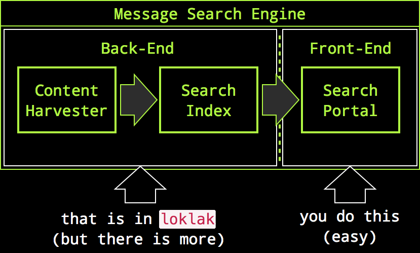

Welcome to the Loklak Server documentation!
===========================================

.. toctree::
   :caption: Home
   :hidden:

   Welcome <self>

.. toctree::
   :caption: Installation
   :hidden:
   :maxdepth: 1

   Download and Installation <installation/download>
   Video Tutorials <installation/tutorials>
   Installation on Linux/macOS <installation/installation_generic>
   Installation on Windows <installation/installation_windows>
   Installation with Docker <installation/installation_docker>
   Installation on Cloud9 <installation/installation_cloud9>
   Installation on Heroku <installation/installation_heroku>
   
.. toctree::
   :caption: Development
   :hidden:
   :maxdepth: 1

   API <development/api>
   Setup Eclipse <development/eclipseSetup>

.. toctree::
   :caption: Miscellaneous
   :hidden:
   :maxdepth: 1

   Architecture <misc/architecture>
   Parsers <misc/parsers>
   Services <misc/Services>

.. toctree::
   :caption: SUSI
   :hidden:
   :maxdepth: 1

   AskSUSI <susi/AskSUSI>

This is a server application which is able to collect messages from various
sources, including Twitter. This server contains a search index and a
peer-to-peer index sharing interface.

Why should I use Loklak?
------------------------

If you like to be anonymous when searching things, want to archive Tweets or
messages about specific topics and if you are looking for a tool to create
statistics about Tweet topics, then you may consider Loklak. With Loklak you
can:

 * collect and store a very, very large amount of Tweets and similar messages
 * create your own search engine for Tweets
 * omit authentication enforcement for API requests on the Twitter platform
 * share Tweets and Tweet archives with other Loklak users
 * search anonymously on your own search portal
 * create your own Tweet search portal or statistical evaluations
 * analyze large amounts of Tweets as a source for statistical data.

We Capture Messages With Distributed Scrapers
---------------------------------------------

If you want to create an alternative Twitter search portal, the only way would
be to use the official Twitter API to retrieve Tweets. But that interface needs
an OAuth account and it makes your search portal completely dependent on
Twitter's goodwill. The alternative is, to scrape the Tweets from the Twitter
HTML search result pages, but Twitter may still lock you out on your IP address.
To circumvent this, you need many clients accessing Twitter to scrape search
results. This makes it necessary to create a distributed peer-to-peer network of
Twitter scrapers which can all organize, store and index Tweets. This solution
was created with Loklak.

Best of all: we made this very generic to integrate different microblogging
services, so this may be the incubator for an independent short message or
Twitter-like platform.

Not a Search Portal
-------------------

Search portals consist of many components, the most prominent parts are content
harvesters to acquire searchable content, a search index which provides fast and
efficient access to the data and a search front-end containing the user webpages
and result display servlets:

.. image:: _assets/concept_searchengine.png

Most search portals differ in the way how they display search results but have
the almost same back-end to create the search index. We want to support the
creation of message/Twitter search portals but the necessary and most generic
part needs to be coded only once, even if we want several or even many different
search front-ends:

So it's on you to create a message search portal, but the very hard part for
this was already done by us. However, the front-end may also instantly be
there (i.e. you can just use :doc:`Kibana <installation/download>`).

Collect Messages
----------------

Collected messages are processed to two storage targets: an elasticsearch search
index and a backup- and transfer dump.

.. image:: _assets/concept_messagesearchdetail.png

Short-Links are De-Shortened
----------------------------

To use as most possible characters in every Tweet message up to 140 characters,
links are shortened in all Tweets. First users used independent shortener
services but now Twitter shortens even already pre-shortened links again. We
remove the shortening of almost all links in the Tweet and reveal the original
URL the user has attached to their Tweets. This is very important when archiving
Tweets because shorteners may not be available in the future and also gives you
another privacy advancement because the shortener services cannot track you for
their purposes.

.. note::
   
  Loklak can even de-shorten recursively, multi-shortened links.

Anonymous Harvesting and Search
-------------------------------

Anonymity is provided with different methods:

 * The loklak server does not record client IP-adresses when a search is done,
   therefore loklak.org, running loklak does also not record or log IP addresses
   from searchers.
 * You can run loklak yourself which gives you complete control over logged
   things (where no IP addresses are, but whatever).
 * Using a scraper, it is possible to break out of Twitter's 'OAuth-Prison', as
   you don't need an account to harvest Tweets.
   
   .. image:: _assets/component_contentharvester.png
 * If you don't want to search on loklak.org and also don't want to scrape data
   from Twitter, you can still search in your own index and feed this index with
   import files from other loklak peers. (Look out for the 'Dumps' menu item in
   the top right corner.)
   
   .. image:: _assets/component_searchindex.png
 * The built-in short-link de-shortener protects you from tracking by short-link
   services, including Twitter and bit.ly.

Distributed, Peer-to-Peer
-------------------------

Loklak instances can be connected to each other. If you download loklak and run
it unchanged, it connects to loklak.org by default as a back-end peer. You can
change this if you want to. This is how connected peers work:

* Whenever a peer aquires new Tweets, it reports these to the back-end for
  storage. This means that fresh Tweets are stored at four locations: your own
  Elasticsearch index, your own message dump file and in the remote
  back-end-peer in the Elasticsearch index and dump file. This causes
  that all messages that you find are available for download for other
  users at the back-end which is by default loklak.org.
  
  .. image:: _assets/component_jsonlistp2p.png
* Whenever a peer starts up, it calls the back-end to announce it's existence.
  This fills a peer-table in the back-end which everyone can use to retrieve the
  list of active peers. Therefore everyone can identify peers which may provide
  message-lists for download.
* Any topology can be achieved when the user changes the host name of the
  back-end. You can create your own message-sharing network easily.
